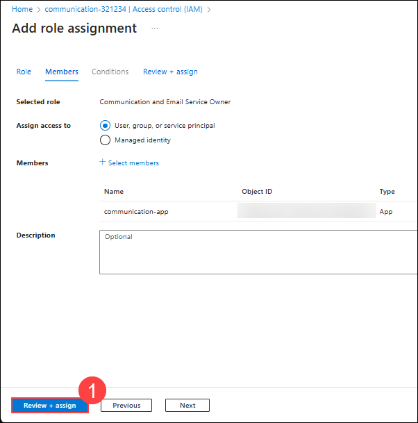

# Lab 01 : Setting Up Azure Communication Services Environment 

## Estimated Duration:  minutes

## Lab Overview


## Lab objectives
In this lab, you will complete the following tasks:
+ Task 1: Provisioning Azure Communication Services (ACS) resources
+ Task 2: Configuring access controls with Microsoft Entra ID
+ Task 3: Exploring the Azure portal to familiarize with ACS features

### Prerequisites:
- An active Azure subscription
- Basic knowledge of Azure portal and Azure CLI

## Task 1: Provisioning Azure Communication Services (ACS) Resources

Azure Communication Services provides APIs for integrating multichannel communication features—such as voice, video, chat, text messaging/SMS, and email—into your applications. With its REST APIs and client library SDKs, you don't need deep technical expertise to add communication capabilities to your apps.

1. On the Azure portal, in **Search resources, services and docs (G+/)** box at the top of the portal search for **Communication Services (1)** and select **Communication Services (2)**.

   

1. On the **Communication Services** blade, click **+ Create**.

   

1. On **Create Resource** blade specify the following settings and click **Review + Create**.

    | Setting | Value |
    | --- | --- |
    | Subscription | **Keep it as default (1)**  |
    | Resource group | **acs-<inject key="DeploymentID"></inject> (2)** |
    | Resource Name | **communication-<inject key="DeploymentID"></inject> (3)**|
    | Data location | **United States (5)** |

   

1. After the validation gets succeeded, click on **Create** to provision communication services.

   

    >**Note**: After clicking on Submit, it might take 2 minutes to provision the communication services.

1. Navigate to the Communication Services resource you created.

1. Go to **Keys** in the left-hand menu.

1. Copy the connection strings and service endpoints. You will use these values to authenticate and connect to the Communication Services resource.

## Task 2: Configuring access controls with Microsoft Entra ID

#### 1. **Create a Service Principal**

1. In the Azure portal, search for **Microsoft Entra ID (1)** and select **Microsoft Entra ID (2)**.

   

1. Select **App registrations (2)** under **Manage (1)** section from the left pan.

   

1. Click on **+ New registration** from upper left corner of App registrations page.

   

1. On **Register an application** blade specify the following settings and click **Register**.

    | Setting | Value |
    | ---  | --- |
    | Name | **communication-app (1)**  |
    | Supported account types | **Accounts in this organizational directory only (xxxx - Single tenant) (2)** |

   

1. Navigate to **Certificates & secrets (1)** under manage section of the newly registered app.

1. Click on **+ New client secret (3)** under **Client secrets (2)** section. On new **Add a client secret** tab, specify the following settings and click on **Add**.

    | Setting | Value |
    | --- | --- |
    | Description | **communication secret (1)**  |
    | Expires | **Keep it as default. It can be changed as per the requirement (2)** |

   

    >**Note**: Copy the client secret value and paste it in notepad for later use before leaving the page as it cannot be viewed, except for immediately after creation.

1. Note the **Application (client) ID** and **Directory (tenant) ID**.

#### 2. **Assign Roles to the Service Principal**

1. Navigate to your **communication-<inject key="DeploymentID"></inject>** Azure Communication Services resource.

1. Select **Access control (IAM) (1)** and click on **+ Add (2)** dropdown the click on **Add role assignment (3)**.

   

1. In the Add role assignment tab, Search **Communication and Email Service Owner (1)** and select the role **Communication and Email Service Owner (2)** then click on **Next (3)**.

   

1. On **Members** tab, keep **Assign access to** as **User, group or service principal (1)** then under **Members** select **+ Select Members (2)**. From select members tab, search and select  **communication-app (3)** service principal then choose **Select (4)**.

   

1. Click on **Review + assign (1)** twice.

   

1. Note the **appId**, **password**, and **tenant** values.

**Integrate with Azure Communication Services SDK**
1. Install the Azure Communication Services SDK in your project:
   ```bash
   dotnet add package Azure.Communication.Common
   dotnet add package Azure.Communication.Email
   ```
1. Use the following code to authenticate using Microsoft Entra ID:
   ```csharp
   var clientSecretCredential = new ClientSecretCredential(
       "<tenant-id>",
       "<client-id>",
       "<client-secret>"
   );

   var emailClient = new EmailClient(
       new Uri("https://<resource-name>.communication.azure.com"),
       clientSecretCredential
   );
   ```

**Test the Configuration**
1. Send a test email using the configured client:
   ```csharp
   var emailMessage = new EmailMessage(
       "<sender-email>",
       new EmailRecipients(new List<EmailAddress> { new EmailAddress("<recipient-email>") }),
       "Test Email",
       new EmailContent("This is a test email.")
   );

   var response = await emailClient.SendAsync(emailMessage);
   Console.WriteLine($"Email sent with status: {response.Status}");
   ```

## Task 3: Exploring the Azure portal to familiarize with ACS features

By the end of this lab, you will have hands-on experience navigating the **Azure Portal**, discovering key features of **Azure Communication Services**, and understanding how to use the portal to manage communication resources.

1. On the Azure portal, in **Search resources, services and docs (G+/)** box at the top of the portal search for **Communication Services (1)** and select **Communication Services (2)**. Select **acs-<inject key="DeploymentID"></inject>** communication service.

   

**Explore Communication Service Features**

Within the **Communication Services** resource page, explore the following features:

1. **Chat**: Azure Communication Services Chat can help you add real-time text communication to your cross-platform applications. Explore the setup for adding real-time chat capabilities to your applications.

   The Chat APIs provide an auto-scaling service for persistently stored text and data communication. Other key features include:

   - **Custom Identity and Addressing** - Azure Communication Services provides generic identities to address communication endpoints. Clients use these identities to authenticate to the Azure service and communicate with each other in chat threads you control.
   - **Encryption** - Chat SDKs encrypt traffic and prevents tampering on the wire.
   - **Microsoft Teams Meetings** - Chat SDKs can join Teams meetings and communicate with Teams chat messages.
   - **Real-time Notifications** - Chat SDKs use efficient persistent connectivity (WebSockets) to receive real-time notifications such as when a remote user is typing. When apps are running in the background, built-in functionality is available to fire pop-up notifications ("toasts") to inform end users of new threads and messages.
   - **Bot Extensibility** - It's easy to add Azure bots to the Chat service with Azure Bot integration.

1. **Email**: Azure Communication Services offers a platform for businesses to enhance customer engagement through email. It supports high-volume transactional, bulk, and marketing emails, including application-to-person (A2P) use cases. With production-ready SDKs and SMTP support, businesses can easily integrate email capabilities into their applications. The service enables collaboration across multiple communication channels, such as SMS, and allows for scalable, reliable email features with pay-as-you-go pricing using your own SMTP domains.
Other key features include:

   - **Azure-managed domain**: Customers can send mail from the pre-provisioned domain (xxxxxxxx-xxxx-xxxx-xxxx-xxxxxxxxxxxx.azurecomm.net).
   - **Custom domain**: Customers can send mail from their own verified domain (notify.contoso.com).
   - **Sender authentication support**: The platform enables support for Sender Policy Framework (SPF) and Domain Keys Identified Mail (DKIM) settings for both Azure-managed and custom domains. Authenticated Received Chain (ARC) support preserves the email authentication result during transitioning.
   - **Email spam protection and fraud detection**: The platform performs email hygiene for all messages. It offers comprehensive email protection through Microsoft Defender components by enabling the existing transport rules for detecting malware: URL Blocking and Content Heuristic.
   - **Email analytics**: The Insights dashboard provides email analytics. The service emits logs at the request level. Each log has a message ID and recipient information for diagnostic and auditing purposes.
   - **Engagement tracking**: The platform supports bounce, blocked, open, and click tracking.

1. **SMS**: Azure Communication Services enables you to send and receive short message service (SMS) text messages using the Communication Services SMS SDKs. These SDKs can be used to support customer service scenarios, appointment reminders, two-factor authentication, and other real-time communication needs. Key features of Azure Communication Services SMS SDKs include:

   - **Simple setup** experience for adding SMS capability to your applications.
   - **High Velocity** message support over toll free numbers and short codes for A2P (Application to Person) use cases in the United States.
   - **Bulk Messaging** supported to enable sending messages to multiple recipients at a time.
   - **Two-way** conversations to support scenarios like customer support, alerts, and appointment reminders.
   - **Reliable Delivery** with real-time delivery reports for messages sent from your application.
   - **Analytics** to track your SMS usage patterns. See SMS insights for details.
   - **Opt-Out** handling support to automatically detect and respect opt-outs for toll-free numbers and short codes. US carriers mandate and enforce opt-outs for US toll-free numbers.

1. **Voice and Video**: Learn how to enable voice and video calling for your app. Azure Communication Services allows end-user browsers, apps, and services to drive voice and video communication.

   The Calling SDK offers several features for enhanced communication:

- **Device Management and Media**: Allows binding to audio/video devices, encoding for efficient transmission, and screen/application sharing.
- **PSTN**: Supports initiating voice calls with traditional phone networks using Azure-acquired or BYO numbers.
- **Teams Meetings & Calling**: Can join and interact with Teams meetings for voice and video calls.
- **Encryption**: Ensures secure communication by encrypting traffic.
- **Addressing**: Uses generic identities for endpoint communication and call visibility.
- **User Access Security**: Manages user roles, permissions, and call access through Virtual Rooms.
- **Notifications**: Alerts users of incoming calls with customizable notifications.
- **Media Stats**: Provides metrics for call quality analysis and optimization.
- **Video Constraints**: Allows control over video quality, including resolution and frame rate.
- **User Facing Diagnostics (UFD)**: Tracks call quality issues like network problems or muted microphones.
- **Real Time Text (RTT)**: Enables near real-time text during calls for users with speaking difficulties.

### Conclusion:
By completing this lab, you should be able to provision Azure Communication Services resources using both the Azure portal and Azure CLI effectively.
